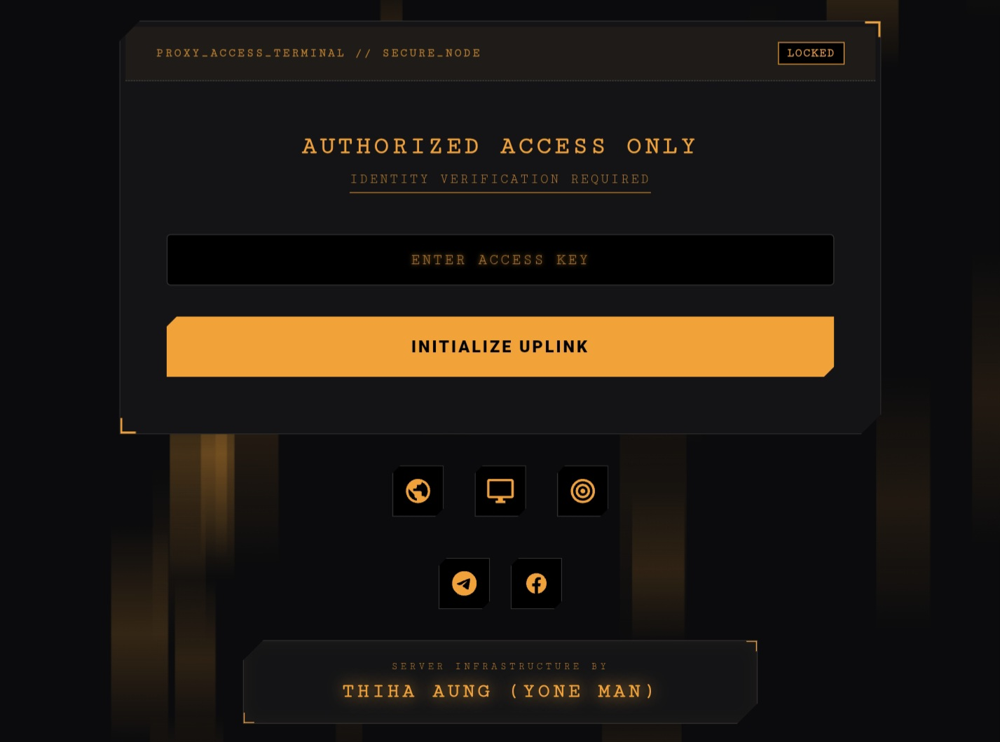

# PROXY_ACCESS_TERMINAL
Serverless VPN/Proxy link distribution panel powered by Cloudflare Workers &amp; KV Storage. Includes password authentication and clipboard management

# 🛡️ PROXY_ACCESS_TERMINAL

A high-security, cyberpunk-themed web terminal for distributing secure VPN/Proxy configurations. Built entirely on **Cloudflare Workers** and **KV Storage**.

---

## 📸 System Interface

| **🔐 Secure Gateway** | **⚡ Data Uplink** |
|:---:|:---:|
|  |  |

> *Please upload your dashboard screenshot as `data-uplink.jpg` to appear above.*

---

## ⚙️ Environment Variables (KV Setup)

To configure the system, go to **Cloudflare Dashboard > Workers & Pages > KV**, create a namespace (e.g., `MY_KV`), and add the following keys:

| 🔑 Key Name | ✅ Required | 📝 Description | 💡 Example Value |
| :--- | :---: | :--- | :--- |
| **`PASSWORD`** | **Yes** | The secure access code required to login to the terminal. | `123456` |
| **`NODE_DATA`** | **Yes** | The collection of VPN/Proxy links. Supports VLESS, VMess, Trojan, etc. | `Singapore | vless://...` `Japan | vmess://...` |

---

## ⚡ Key Features

* **🔐 Secure Gateway:** Password-protected login screen.
* **🎨 Industrial UI:** Cyberpunk theme with neon orange accents and breathing animations.
* **📂 KV Integration:** Dynamic data fetching from Cloudflare KV.
* **📋 Smart Clipboard:**
    * **Copy All:** Bulk export all links (auto-removes titles).
    * **Individual Copy:** Select specific nodes.
* **🚀 Serverless:** Zero cost, high availability via Cloudflare Pages.

---

## 🛠️ Deployment Guide

1.  **Fork** this repository.
2.  Create a project on **Cloudflare Pages** and connect your Git repo.
3.  Go to **Settings > Functions > KV Namespace Bindings**.
4.  Add a binding with Variable name: **`MY_KV`**.
5.  **Redeploy** the project.

---

## 📝 Data Formatting

You can add custom titles to your links in `NODE_DATA` using the pipe `|` separator.

| Format | Example | Result |
| :--- | :--- | :--- |
| **With Title** | `Gaming Node | vless://...` | Shows **"Gaming Node"** on UI |
| **No Title** | `vless://...` | Shows **"SERVER NODE XX"** |

---

## 📄 License

This project is licensed under the **MIT License**.

---

**SERVER INFRASTRUCTURE BY**

<h3>THIHA AUNG (YONE MAN)</h3>

 

